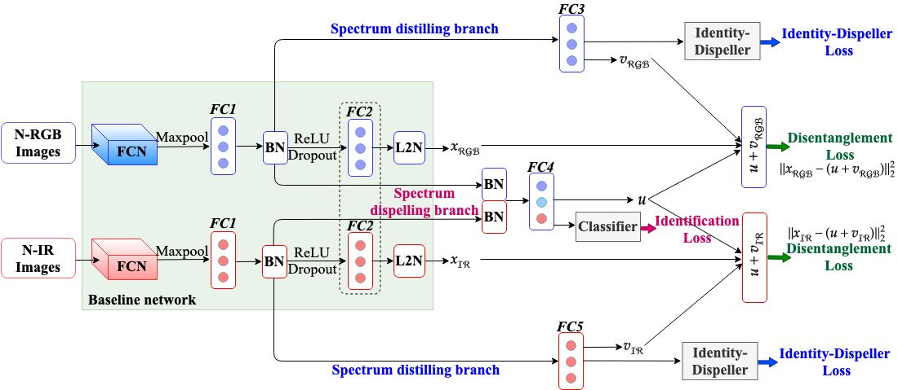

# SDL
This project aims at re-identify person under different spectrum using disentanglement learning network. It is based on our IEEE-TCSVT 2020 paper. 

# Architecture


# Pre-processing

- (1) RegDB Dataset [1]: The RegDB dataset can be downloaded from this [website](http://dm.dongguk.edu/link.html) by submitting a copyright form.

    - (Named: "Dongguk Body-based Person Recognition Database (DBPerson-Recog-DB1)" on their website). 

- (2) SYSU-MM01 Dataset [2]: The SYSU-MM01 dataset can be downloaded from this [website](http://isee.sysu.edu.cn/project/RGBIRReID.htm).

   - run `python pre_process_sysu.py` to pepare the dataset, the training data will be stored in ".npy" format.

# Training

Train a model by
  ```bash
python training_filename --dataset sysu --lr 0.01 --drop 0.0 --trial 1 --gpu 1
```

  - `training_filename`: name of the training file.
  
  - `--dataset`: which dataset "sysu" or "regdb".

  - `--lr`: initial learning rate.
  
  -  `--drop`: dropout ratio.
  
  -  `--trial`: training trial (only for RegDB dataset).

  -  `--gpu`: which gpu to run.

You may need mannully define the data path first.

**Training Log**: The training log will be saved in `log/" dataset_name"+ log`. 
**Final Model**: It will be saved in `save_model/`.

### 3. Testing.

Test a model on SYSU-MM01 or RegDB dataset by 
  ```bash
python testing-filename.py --mode all --resume 'model_path' --gpu 1 --dataset sysu
```
  - `testing-filename`: name of the testing file.

  - `--dataset`: which dataset "sysu" or "regdb".
  
  - `--mode`: "all" or "indoor" all search or indoor search (only for sysu dataset).
  
  - `--trial`: testing trial (only for RegDB dataset).
  
  - `--resume`: the saved model path.
  
  - `--gpu`:  which gpu to run.

Contact: kajalk@iiitd.ac.in


# Citation
If you use any of the provided code, please cite:
```
@article{kansal2020sdl,
  title={SDL: Spectrum-Disentangled Representation Learning for Visible-Infrared Person Re-identification},
  author={Kansal, Kajal and Subramanyam, AV and Wang, Zheng and Satoh, Shin’ichi},
  journal={IEEE Transactions on Circuits and Systems for Video Technology},
  year={2020},
  publisher={IEEE}
}
}
```
